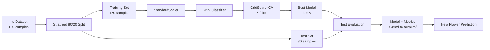

# KNN Iris Classification

A complete machine learning pipeline that classifies Iris flowers using the
**K-Nearest Neighbors (KNN)** algorithm. The project covers data preparation,
leakage-safe preprocessing, hyperparameter tuning, evaluation, model
persistence, reusable prediction, and automated testing.

[Read the project and interview summary](PROJECT_SUMMARY.md)

## Project Objective

The model predicts one of three Iris species from four flower measurements:

| Input feature | Unit |
|---|---|
| Sepal length | centimeters |
| Sepal width | centimeters |
| Petal length | centimeters |
| Petal width | centimeters |

The target classes are **Setosa**, **Versicolor**, and **Virginica**. This is a
supervised multiclass classification problem.

## Machine Learning Pipeline



### Pipeline stages

1. **Load data** — Read scikit-learn's built-in Iris dataset.
2. **Split data** — Create a reproducible, stratified 80/20 train-test split.
3. **Scale features** — Standardize measurements with `StandardScaler`.
4. **Tune KNN** — Test odd values of `k` from 1 through 15.
5. **Cross-validate** — Compare candidates with five-fold cross-validation.
6. **Evaluate** — Measure performance once on the untouched test set.
7. **Persist** — Save the fitted scaler/KNN pipeline and class metadata.
8. **Predict** — Load the artifact and classify new measurements.

`StandardScaler` and `KNeighborsClassifier` are contained in one scikit-learn
`Pipeline`. During cross-validation, the scaler is therefore fitted only on
each training fold. This prevents data leakage and guarantees that future
predictions receive the same preprocessing as the training data.

## Dataset

The Iris dataset contains 150 labeled samples:

| Species | Samples |
|---|---:|
| Setosa | 50 |
| Versicolor | 50 |
| Virginica | 50 |

The split uses `random_state=42` for reproducibility and `stratify=iris.target`
to preserve the balanced class distribution.

## Model Selection

KNN predicts a class by finding the closest training samples and taking a
majority vote. The number of neighbors, `k`, controls the model's complexity:

- A very small `k` can overfit noise.
- A very large `k` can underfit local patterns.
- Odd values reduce the chance of tied votes.

`GridSearchCV` evaluates `k = 1, 3, 5, ..., 15` using five-fold
cross-validation. The best configuration is then fitted on all training data.

## Verified Results

| Metric | Result |
|---|---:|
| Best number of neighbors | 5 |
| Mean cross-validation accuracy | 96.7% |
| Test accuracy | 93.3% |
| Correct test predictions | 28 / 30 |

### Confusion matrix

Rows represent actual classes and columns represent predicted classes.

| Actual / Predicted | Setosa | Versicolor | Virginica |
|---|---:|---:|---:|
| Setosa | 10 | 0 | 0 |
| Versicolor | 0 | 10 | 0 |
| Virginica | 0 | 2 | 8 |

The model classified every Setosa and Versicolor test sample correctly. Two
Virginica samples were predicted as Versicolor.

## Project Structure

```text
decodelabs_task2/
├── train_knn.py         # Training, tuning, evaluation, and persistence
├── predict.py           # Command-line prediction for one flower
├── test_knn.py          # Automated model-quality test
├── pyproject.toml       # Python and dependency configuration
├── uv.lock              # Reproducible dependency lock file
├── PROJECT_SUMMARY.md   # Concepts, presentation notes, and interview Q&A
├── README.md            # Project documentation
└── outputs/             # Generated locally; excluded from Git
    ├── knn_iris_model.joblib
    ├── metrics.json
    ├── confusion_matrix.csv
    └── test_predictions.csv
```

## Requirements

- Python 3.10 or newer
- [uv](https://docs.astral.sh/uv/) for dependency and environment management

The main Python dependencies are:

- scikit-learn
- Joblib

## Installation

Clone the repository and enter its directory:

```powershell
git clone https://github.com/hongiranas-dev/decodelabs_task2.git
cd decodelabs_task2
```

Create the environment and install the locked dependencies:

```powershell
uv sync
```

## Train the Model

```powershell
uv run python train_knn.py
```

Expected summary:

```text
Best k: 5
CV accuracy: 0.967
Test accuracy: 0.933
Artifacts saved to: ...\outputs
```

To save artifacts in another directory:

```powershell
uv run python train_knn.py --output-dir my_artifacts
```

## Make a Prediction

Pass the four measurements in this order:

```text
sepal_length sepal_width petal_length petal_width
```

Example:

```powershell
uv run python predict.py 5.1 3.5 1.4 0.2
```

Expected output:

```text
Predicted class: setosa
Class probabilities:
  setosa: 100.0%
  versicolor: 0.0%
  virginica: 0.0%
```

Use a model saved at a custom path:

```powershell
uv run python predict.py 5.1 3.5 1.4 0.2 --model my_artifacts/knn_iris_model.joblib
```

## Run the Test

```powershell
uv run python -m unittest -v
```

The test verifies that:

- Test accuracy is at least 90%.
- Grid search selects one of the configured odd values of `k`.

## Generated Outputs

Training creates an `outputs/` directory containing:

| Artifact | Description |
|---|---|
| `knn_iris_model.joblib` | Fitted scaler/KNN pipeline and class metadata |
| `metrics.json` | Accuracy, best `k`, and per-class evaluation metrics |
| `confusion_matrix.csv` | Actual-versus-predicted class counts |
| `test_predictions.csv` | Held-out samples with actual and predicted classes |

Generated outputs are ignored by Git because they can be reproduced by running
the training command.

## Key Design Decisions

- **Scaling:** Necessary because KNN relies on feature distances.
- **Pipeline:** Prevents preprocessing leakage and keeps inference consistent.
- **Stratification:** Keeps all three classes balanced in both data splits.
- **Cross-validation:** Selects `k` more reliably than a single validation set.
- **Fixed seed:** Makes evaluation reproducible.
- **Complete artifact:** Saves preprocessing, model, feature names, and labels
  together.
- **Locked dependencies:** Makes the environment reproducible.

## Possible Improvements

- Compare Euclidean and Manhattan distance.
- Test uniform voting against distance-weighted voting.
- Add visualizations for feature distributions and prediction errors.
- Add stricter validation for command-line inputs.
- Expose predictions through Streamlit or FastAPI.
- Add continuous integration to run tests on every push.

## License

This project is available under the terms in [LICENSE](LICENSE).
